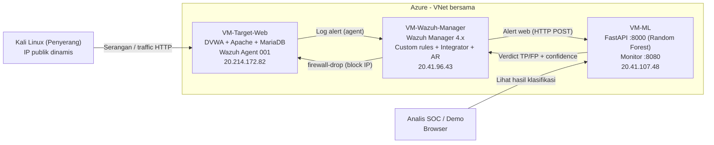
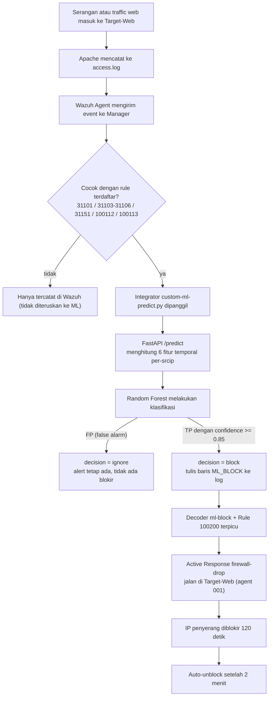
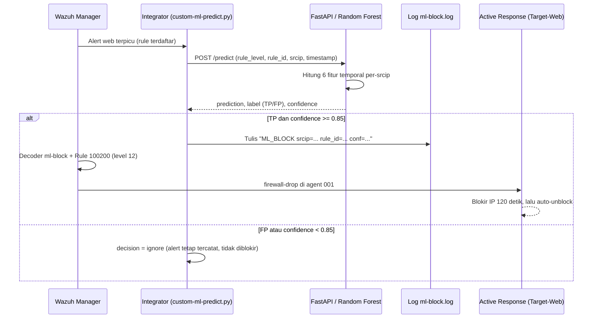

# Reducing SOC False Alarms through Human-AI Collaboration

Sistem Security Operations Center (SOC) skala kecil yang menggabungkan Wazuh (SIEM/HIDS) dengan model Machine Learning buatan sendiri untuk memilah alert yang benar-benar berbahaya (true positive) dari alarm palsu (false positive), lalu menindaklanjuti keputusan model secara otomatis melalui mekanisme SOAR (Active Response).

Inti masalah yang diangkat: aturan deteksi berbasis rule sering memunculkan banyak alarm yang sebenarnya tidak berbahaya. Analis SOC kewalahan menyaringnya satu per satu (alert fatigue). Proyek ini menunjukkan bahwa untuk kelas alert yang ambigu, perilaku temporal sebuah sumber (seberapa cepat dan seteratur apa request datang) membawa sinyal yang cukup untuk memisahkan serangan otomatis dari aktivitas wajar — sesuatu yang tidak bisa dilakukan oleh level rule saja.

---

## Daftar Isi

1. [Ringkasan Sistem](#1-ringkasan-sistem)
2. [Arsitektur yang Diimplementasikan](#2-arsitektur-yang-diimplementasikan)
3. [Deteksi dan Definisi False Alarm (Custom Rules)](#3-deteksi-dan-definisi-false-alarm-custom-rules)
4. [Dataset](#4-dataset)
5. [Model AI yang Digunakan](#5-model-ai-yang-digunakan)
6. [Metrik Benchmark](#6-metrik-benchmark)
7. [Analisis Hasil](#7-analisis-hasil)
8. [Integrasi dan SOAR (Human-AI Collaboration)](#8-integrasi-dan-soar-human-ai-collaboration)
9. [Temuan Penting](#9-temuan-penting)
10. [Keterbatasan](#10-keterbatasan)
11. [Cara Menjalankan dan Reproduksi](#11-cara-menjalankan-dan-reproduksi)
12. [Struktur Komponen](#12-struktur-komponen)

---

## 1. Ringkasan Sistem

Sistem berjalan di atas beberapa virtual machine Azure (Ubuntu 22.04 LTS). Wazuh berperan sebagai SIEM/HIDS yang mengumpulkan dan menganalisis log. Ketika sebuah alert pada kategori web terpicu, alert tersebut dikirim ke layanan inferensi (FastAPI) yang menjalankan model Random Forest. Model memberi label TP atau FP. Jika model yakin sebuah alert adalah serangan (true positive dengan keyakinan tinggi), keputusannya dikembalikan ke Wazuh dan memicu pemblokiran IP penyerang secara otomatis selama dua menit.

Penekanan desain ada pada satu hal: keputusan blokir digerakkan oleh model AI, bukan sekadar oleh level rule. Inilah yang membedakannya dari Active Response Wazuh standar dan menjadikannya kolaborasi manusia-AI yang sebenarnya — mesin menyaring, analis tetap memegang kendali dan interpretasi.

| Komponen | Alamat | Peran |
|----------|--------|-------|
| VM-Wazuh-Manager | 20.41.96.43 | Wazuh Manager (SIEM/HIDS), pusat rule, integrasi, dan Active Response |
| VM-Target-Web | 20.214.172.82 | DVWA (target rentan) + Wazuh Agent (ID 001) |
| VM-ML | 20.41.107.48 | Layanan inferensi FastAPI (port 8000) + dashboard monitor (port 8080) |
| Penyerang | IP dinamis | Kali Linux (WSL), sumber serangan dan traffic uji |

Catatan versi: Wazuh yang dipakai berada pada seri 4.x (manager melaporkan `wazuh-logtest v4.14.5`). Pastikan versi agent selaras dengan manager. Versi pasti dapat diperiksa dengan `sudo /var/ossec/bin/wazuh-control info`.

---

## 2. Arsitektur yang Diimplementasikan

### 2.1 Diagram arsitektur (komponen dan jaringan)



### 2.2 Alur pipeline (dari serangan hingga blokir)



### 2.3 Keputusan arsitektur penting

- **HIDS sebagai sumber alert.** Wazuh dipilih sebagai SIEM/HIDS. Konsekuensinya didokumentasikan pada bagian Temuan: deteksi berbasis log tidak melihat serangan layer 4 (lihat 9.1).
- **Komputasi fitur di sisi inferensi.** Fitur temporal (laju dan keteraturan request) tidak ada dalam satu alert tunggal; harus dihitung dari deretan alert sebelumnya per sumber IP. Komputasi ini diletakkan pada layanan FastAPI agar definisinya satu sumber dan identik dengan pipeline pelatihan.
- **Inferensi single-worker.** Layanan FastAPI menyimpan riwayat per-IP di memori untuk menghitung fitur. Karena state ini per-proses, layanan wajib berjalan dengan satu worker. Menjalankan beberapa worker memecah riwayat antar proses sehingga hitungan laju menjadi terlalu kecil dan serangan berisiko salah diklasifikasi sebagai false alarm.
- **Active Response native, bukan SOAR eksternal.** Implementasi SOAR menggunakan Active Response bawaan Wazuh (`firewall-drop`) yang dipicu oleh keputusan model, bukan platform orkestrasi eksternal. Pendekatan ini lebih ringan, lebih mudah dikontrol, dan tidak bergantung pada layanan pihak ketiga.
- **Blokir dijalankan di Target-Web, bukan Manager.** Karena serangan mendarat di Target-Web, `firewall-drop` diarahkan ke agent 001 (`<location>defined-agent</location>`). Jika blokir dijalankan di Manager, iptables Manager yang terisi sementara serangan web tetap menjangkau Target.

---

## 3. Deteksi dan Definisi False Alarm (Custom Rules)

### 3.1 Definisi false alarm pada proyek ini

False alarm didefinisikan sebagai alert yang benar-benar terbit oleh Wazuh tetapi merepresentasikan aktivitas jinak. Contoh konkret yang dirancang dan dikumpulkan: sejumlah request HTTP 404 (mengarah ke halaman atau aset yang tidak ada) dari satu IP dalam waktu singkat. Ini wajar terjadi pada klien jinak (bookmark lama, tautan rusak, prefetch), namun memicu rule berbasis laju. Aktivitas yang sama persis pada level rule juga muncul saat sebuah scanner otomatis bekerja — di situlah letak ambiguitasnya.

### 3.2 Hierarki rule (versi final)

```
31101  (bawaan)   Web 4xx / 404 atomik              -> per request
31151  (bawaan)   6+ web 4xx dalam 20s, IP sama     -> agregat laju
100112 (custom)   Relabel 31151, "laju request      -> level 6, zona abu-abu (TP+FP)
                  web meningkat"
100113 (custom)   100112 berulang 2x dalam 60s      -> level 10, DoS sustained (TP)
100200 (custom)   Penanda keputusan blokir dari ML  -> level 12, pemicu Active Response
```

Isi `local_rules.xml` untuk rule rate (ringkas):

```xml
<group name="custom_web_attacks,">
  <rule id="100112" level="6">
    <if_sid>31151</if_sid>
    <description>Custom: Elevated web request rate from $(srcip) (possible scan/burst)</description>
    <group>dos,</group>
  </rule>

  <rule id="100113" level="10" frequency="2" timeframe="60">
    <if_matched_sid>100112</if_matched_sid>
    <same_source_ip />
    <description>Custom: DoS attack detected from $(srcip) - sustained high 4xx rate</description>
    <group>dos,ddos,</group>
  </rule>
</group>
```

### 3.3 Catatan rekayasa (mengapa desainnya berakhir seperti ini)

Desain rule ini adalah hasil beberapa kali revisi. Proses tersebut sendiri merupakan temuan tentang bagaimana rule correlation Wazuh berperilaku, dan didokumentasikan karena relevan untuk siapa pun yang membangun rule serupa:

1. **Versi awal tanpa threshold.** Rule "possible DoS" awal memakai `if_sid` tanpa ambang, sehingga setiap satu request memicu satu alarm — bahkan satu kali login. Ini false positive yang terlalu sepele dan justru melemahkan argumen perlunya ML. Diperbaiki dengan menambah threshold berbasis laju.
2. **Base rule level-0 menelan alert.** Sempat dibuat base rule `level="0"` sebagai counter. Akibatnya alert `31101` ikut ditelan dan hilang dari `alerts.json`. Pelajaran: rule anak level-0 menggantikan dan menyenyapkan alert induknya.
3. **`if_matched_group` tidak reliabel** pada ruleset ini; rule yang menghitung grup `web` tidak pernah terpicu meski eventnya ada.
4. **Monopoli oleh rule bawaan 31151.** Rule custom yang menghitung stream `31101` mentah tidak pernah terpicu karena rule bawaan `31151` lebih dulu mengonsumsi event tersebut. Solusi final adalah menumpuk di atas `31151` (yang terbukti terpicu), bukan berebut stream yang sama.

Rancangan akhir mempertahankan `31101` tetap muncul (sebagai data atomik), sementara `100112` dan `100113` membaca agregat di atasnya.

---

## 4. Dataset

### 4.1 Pengumpulan

Data dikumpulkan dengan menjalankan skenario serangan terukur dari Kali ke Target-Web, lalu menyalin `alerts.json` Wazuh. Tiap fase serangan dicatat jendela waktunya (dalam WIB dan UTC) agar pelabelan akurat. Active Response dimatikan sementara selama fase ini agar serangan tidak terblokir sebelum data terkumpul.

Fase yang dijalankan: nikto (web scan), sqlmap (SQL injection), SYN flood (hping3), SSH brute force (Hydra), dan traffic normal. Sesi tambahan traffic jinak (burst 404 dengan jeda acak) dijalankan untuk menambah jumlah contoh false positive.

### 4.2 Pelabelan

Pelabelan tidak dilakukan berdasarkan rule ID, karena rule yang sama bisa TP atau FP. Label ditentukan oleh kombinasi **jendela waktu + IP sumber**:

- Alert dari IP penyerang di dalam jendela serangan diberi label sesuai jenis serangan (TP).
- Alert dari IP penyerang di dalam jendela traffic normal diberi label FP.
- Kegagalan autentikasi SSH dari IP selain penyerang diberi label TP (bot internet asli).
- Sisanya (noise sistem) diberi label benign.

Konversi zona waktu (timeline dalam WIB, `alerts.json` dalam UTC) merupakan titik rawan yang ditangani secara eksplisit dalam skrip pelabelan.

### 4.3 Komposisi akhir

Total 1.549 baris alert berlabel (`dataset_labeled.csv`).

| Label | Jumlah | Porsi |
|-------|--------|-------|
| 0 (False Positive) | 179 | 11,6% |
| 1 (True Positive) | 1.370 | 88,4% |

Rincian per jenis aktivitas:

| attack_type | Jumlah | Label |
|-------------|--------|-------|
| nikto | 1.193 | TP |
| normal_boost | 124 | FP |
| real_bot_ssh | 112 | TP |
| sqlmap | 53 | TP |
| noise_benign | 29 | FP |
| normal_traffic | 26 | FP |
| ssh_brute | 12 | TP |

Distribusi ini tidak seimbang (sekitar 1:7,6) dan didominasi oleh nikto. Ketidakseimbangan ditangani pada tahap pemodelan (lihat 5.4).

---

## 5. Model AI yang Digunakan

### 5.1 Algoritma

Random Forest (scikit-learn 1.6.1), 300 pohon, `class_weight="balanced"`. Random Forest dipilih karena tahan terhadap fitur berskala berbeda, memberikan feature importance yang mudah diinterpretasi (penting untuk justifikasi laporan), dan bekerja baik pada dataset berukuran kecil tanpa penyetelan ekstensif.

### 5.2 Rekayasa fitur (inti pendekatan)

Pengamatan kunci: dua baris alert yang identik pada kolom mentah (rule, level, deskripsi, IP) bisa berasal dari serangan atau dari aktivitas jinak. Pembedanya bukan ada di satu baris, melainkan pada konteks temporal di sekitar baris itu. Oleh karena itu fitur dihitung per-srcip dari deretan alert sebelumnya, dengan jendela mundur (causal) agar dapat direproduksi saat inference:

| Fitur | Makna |
|-------|-------|
| `rule_level` | Tingkat severity rule |
| `inter_arrival_time` | Jeda (detik) ke alert sebelumnya dari IP yang sama |
| `alert_count_10s` | Jumlah alert dari IP ini dalam 10 detik terakhir |
| `alert_count_30s` | Idem, 30 detik |
| `alert_count_60s` | Idem, 60 detik |
| `iat_std` | Standar deviasi jeda 5 alert terakhir (kecil = teratur/mesin, besar = acak/manusiawi) |

Intuisinya: scanner otomatis menghasilkan request yang rapat dan sangat teratur; klien jinak menghasilkan request yang lebih jarang dan berirama tidak teratur. Statistik laju dan keteraturan inilah yang dipelajari model.

### 5.3 Pencegahan kebocoran (data leakage)

Beberapa kolom sengaja tidak dijadikan fitur untuk mencegah model "curang":

- `timestamp` absolut — TP dan FP berasal dari jendela waktu berbeda, sehingga jam absolut bisa dihafal. Hanya fitur relatif yang dipakai.
- `attack_type` — praktis setara dengan label.
- `srcip` — sumber serangan dan traffic jinak sengaja dibuat dari IP yang sama, sehingga IP tidak membantu memisahkan; namun IP dikeluarkan untuk menghindari hafalan pada kasus lain (mis. bot SSH).
- `firedtimes` — counter kumulatif Wazuh yang naik sepanjang sesi, sehingga merupakan proksi waktu absolut.
- `rule_id`, `rule_desc`, `groups` — dikeluarkan agar model dipaksa belajar dari perilaku, bukan identitas rule.

### 5.4 Lingkup model dan penanganan ketidakseimbangan

Model difokuskan hanya pada alert web (nikto, sqlmap, traffic normal/boost). Alert SSH dan noise sistem dikeluarkan dari pelatihan dengan alasan yang dijelaskan pada 9.4. Untuk mengurangi dominasi nikto yang redundan, kelas mayoritas nikto di-downsample menjadi 300 baris. Setelah penyaringan ini, data latih menjadi 503 baris (TP 353, FP 150), dan `class_weight="balanced"` menangani sisa ketidakseimbangan. Pembagian latih/uji 80/20 dengan stratifikasi.

---

## 6. Metrik Benchmark

### 6.1 Metrik yang digunakan dan alasannya

Akurasi mentah tidak memadai untuk tugas pengurangan false alarm pada data yang tidak seimbang: model bisa mencapai akurasi tinggi hanya dengan selalu menebak kelas mayoritas, dan justru gagal menangkap satu pun false alarm. Karena itu metrik utama yang digunakan adalah:

- **Confusion matrix** — melihat sebaran kesalahan secara eksplisit.
- **Precision, recall, F1 per kelas** — dengan perhatian khusus pada kelas FP (recall FP = berapa persen false alarm yang berhasil ditandai).
- **Jumlah serangan yang salah dicap benign (false negative pada kelas TP)** — metrik yang paling kritikal untuk keamanan, karena kesalahan jenis ini berarti serangan asli lolos. Idealnya nol.
- **Feature importance** — untuk interpretabilitas dan untuk memverifikasi bahwa model belajar dari fitur perilaku, bukan dari severity rule.

### 6.2 Hasil pada test set (101 alert)

Confusion matrix:

```
                 prediksi_FP   prediksi_TP
   aktual_FP          30             0
   aktual_TP           0            71
```

Laporan klasifikasi:

| Kelas | Precision | Recall | F1 | Support |
|-------|-----------|--------|----|---------|
| FP (false alarm) | 1,000 | 1,000 | 1,000 | 30 |
| TP (real) | 1,000 | 1,000 | 1,000 | 71 |
| Akurasi | | | 1,000 | 101 |

- Recall FP (false alarm tertangkap): 100%
- Serangan asli salah dicap benign: 0

### 6.3 Feature importance

| Fitur | Importance |
|-------|-----------|
| `alert_count_60s` | 0,366 |
| `alert_count_30s` | 0,243 |
| `alert_count_10s` | 0,230 |
| `iat_std` | 0,126 |
| `inter_arrival_time` | 0,034 |
| `rule_level` | 0,001 |

---

## 7. Analisis Hasil

### 7.1 Interpretasi feature importance

Tiga fitur laju (`alert_count_60s/30s/10s`) menyumbang sekitar 0,84 dari total importance, dan keteraturan (`iat_std`) menambah 0,13. Sebaliknya, `rule_level` praktis nol (0,001). Artinya model hampir tidak menggunakan severity rule untuk memutuskan; ia memisahkan TP dari FP murni berdasarkan pola perilaku temporal. Ini adalah bukti kuantitatif untuk tesis proyek: untuk alert web yang ambigu, level rule tidak membawa informasi pemisah yang berarti, sedangkan ritme request membawanya.

### 7.2 Bukti pemisahan pada IP dan rule yang sama

Pengamatan paling meyakinkan datang dari pengujian langsung pada pipeline. Sebuah IP yang sama (`103.94.191.181`), pada rule yang sama (`31101`), diklasifikasi berbeda tergantung perilakunya:

- Saat menjalankan scan rapat: `alert_count_60s` mencapai 500, `iat_std` mendekati 0, hasil **TP** dengan confidence 1,000.
- Saat traffic jinak yang jarang: `alert_count_60s` hanya 3-4, `inter_arrival_time` 4-48 detik, `iat_std` sekitar 100, hasil **FP** dengan confidence 0,93-0,99.

Karena IP dan rule identik, satu-satunya hal yang berubah adalah ritme — dan model menangkapnya. Ini menutup kemungkinan bahwa model "curang" lewat identitas sumber.

### 7.3 Generalisasi ke IP baru

IP yang diuji pada pipeline (`103.94.191.181`, `103.94.191.135`) berbeda dari IP yang digunakan saat pelatihan (`182.8.100.43`). Model tetap mengklasifikasi dengan benar pada IP yang belum pernah dilihatnya. Ini mengindikasikan bahwa model tidak menghafal IP, melainkan menggeneralisasi pola perilaku.

### 7.4 Soal skor sempurna

Skor 100% pada semua metrik bukan klaim bahwa model sempurna di dunia nyata. Skor ini terjadi karena pada dataset ini pemisahan perilaku antara scan otomatis dan traffic jinak sangat tajam, sehingga 101 baris uji mudah dipisahkan. Yang dibuktikan adalah bahwa fitur temporal memang membawa sinyal pemisah yang nyata, bukan bahwa sistem akan mencapai akurasi sama pada traffic produksi yang lebih beragam. Keterbatasan ini dibahas di bagian 10.

---

## 8. Integrasi dan SOAR (Human-AI Collaboration)

### 8.1 Aliran keputusan

Active Response Wazuh standar dipicu oleh rule, bukan oleh prediksi model. Agar keputusan model benar-benar menjadi pemicu respons, verdict model dikembalikan ke Wazuh sebagai event yang dapat di-rule-kan:



### 8.2 Komponen integrasi

- **Integrator** (`/var/ossec/integrations/custom-ml-predict.py`): dipanggil Wazuh untuk rule `31101, 31103, 31104, 31105, 31106, 31151, 100112, 100113`. Mengekstrak field alert, memanggil API, dan menulis penanda `ML_BLOCK` bila keputusan blokir terpenuhi. Memiliki allowlist IP agar tidak memblokir infrastruktur sendiri.
- **Decoder** (`ml-block`, `ml-block-fields`): mem-parse baris `ML_BLOCK` menjadi field `srcip`, `rule_id`, `ml_conf`.
- **Rule 100200** (level 12): terpicu oleh decoder `ml-block`, menjadi pemicu Active Response.
- **Active Response**: `firewall-drop` dengan `<location>defined-agent</location>`, `<agent_id>001</agent_id>`, `<rules_id>100200</rules_id>`, `<timeout>120</timeout>`.

```xml
<active-response>
  <command>firewall-drop</command>
  <location>defined-agent</location>
  <agent_id>001</agent_id>
  <rules_id>100200</rules_id>
  <timeout>120</timeout>
</active-response>
```

### 8.3 Verifikasi end-to-end

Rantai penuh diuji dan terbukti: serangan dari Kali memicu klasifikasi TP, integrator menulis `ML_BLOCK`, rule 100200 terpicu, dan `firewall-drop` memasang aturan `DROP` untuk IP penyerang di iptables Target-Web. Setelah dua menit, aturan tersebut hilang secara otomatis (auto-unblock terverifikasi).

### 8.4 Posisi false alarm dalam alur

Penting untuk dicatat bahwa alert false positive tidak dihapus dari Wazuh. Wazuh tetap mencatat seluruh alert seperti biasa. Kontribusi model adalah menandai mana alert yang dapat diabaikan, sehingga beban analis berkurang — bukan mengurangi jumlah alert mentah. Untuk false positive, keputusan model adalah `ignore` (tidak ada blokir, data tetap utuh untuk forensik). Pendekatan ini mengikuti prinsip SOC: jangan menghilangkan data, cukup memberi prioritas.

### 8.5 Dashboard monitor

Dashboard read-only (port 8080) membaca log inferensi dan menampilkan jumlah TP/FP, porsi false alarm, serta feed prediksi terbaru lengkap dengan nilai fitur. Dashboard ini murni membaca log dan tidak menyentuh API atau model, sehingga tidak menimbulkan risiko pada pipeline.

---

## 9. Temuan Penting

### 9.1 HIDS tidak mendeteksi serangan layer 4

SYN flood (hping3 `--flood`, ratusan ribu paket) tidak menghasilkan satu pun alert Wazuh. Karena Wazuh di sini adalah HIDS berbasis log dan SYN flood tidak menyelesaikan TCP handshake, tidak ada jejak di `access.log`. Ini bukan kegagalan konfigurasi melainkan keterbatasan inheren HIDS terhadap serangan network-layer. Serangan HTTP flood (layer 7) tetap terdeteksi karena meninggalkan jejak log.

### 9.2 Rule dan IP yang sama bisa TP atau FP

Seperti dibahas di 7.2, rule `31101` dan IP yang sama dapat menghasilkan klasifikasi berbeda tergantung perilaku. Ini adalah pembuktian operasional bahwa pemisahan berbasis rule saja tidak cukup.

### 9.3 Serangan internet asli selama pengumpulan data

Selama pengumpulan data, terdeteksi SSH brute force nyata dari IP internet (bukan IP penyerang yang dikendalikan) ke SSH Manager yang terekspos. Aktivitas ini dilabeli sebagai true positive nyata, dan menunjukkan pipeline mendeteksi ancaman riil, bukan hanya serangan simulasi.

### 9.4 SSH dikeluarkan dari lingkup model

Pada data ini, seluruh alert SSH berlabel TP, dan profil fiturnya (volume rendah, jeda besar) justru menyerupai kelas FP web. Memaksakan SSH ke dalam model rate-based berisiko membuat serangan SSH asli salah diklasifikasi sebagai false alarm. Karena itu SSH ditangani langsung oleh rule Wazuh (deteksi brute force bawaan), sementara model difokuskan pada zona abu-abu alert web. Pembagian peran ini juga merupakan desain SOC yang masuk akal: rule menangani kasus yang sudah jelas, model menangani kasus yang ambigu.

### 9.5 Perilaku operasional Active Response pada serangan bervolume tinggi

Saat serangan flood bervolume sangat tinggi memicu banyak keputusan blokir beruntun untuk satu IP, aturan `DROP` dapat tertumpuk di iptables. Karena auto-unblock memproses timeout per-entry, sebagian aturan dapat tertinggal melebihi dua menit. Implikasi praktis: untuk demonstrasi yang rapi, gunakan intensitas serangan yang cukup memicu klasifikasi TP tanpa membanjiri Active Response, atau bersihkan aturan secara manual bila perlu (lihat 11).

---

## 10. Keterbatasan

- **Traffic jinak disintesis.** Burst 404 jinak dibuat dengan jeda acak untuk meniru perilaku manusia. Densitas dan keteraturan scanner bersifat otentik (memang demikian cara kerja alat scan), tetapi keacakan sisi jinak adalah hasil rekayasa terkontrol. Traffic jinak dunia nyata yang berbeda (misalnya health-check bot yang justru teratur) berpotensi menurunkan kinerja. Validasi pada traffic produksi merupakan pekerjaan lanjutan.
- **Skor sempurna mencerminkan dataset, bukan dunia nyata.** Pemisahan yang sangat tajam pada dataset ini membuat metrik mencapai 100%. Angka ini sebaiknya disajikan sebagai bukti bahwa sinyal temporal nyata, bukan sebagai klaim performa universal.
- **Lingkup terbatas pada alert web.** Model tidak menangani SSH atau kategori alert lain.
- **Ketergantungan single-worker.** Karena state fitur disimpan di memori per proses, layanan tidak dapat diskalakan horizontal tanpa memindahkan state ke penyimpanan bersama.
- **Dataset relatif kecil**, khususnya jumlah false positive yang menarik (sekitar 150 setelah penambahan). Dataset lebih besar dan lebih beragam akan memperkuat klaim generalisasi.

---

## 11. Cara Menjalankan dan Reproduksi

### 11.1 Urutan menjalankan setelah VM dihidupkan

1. Hidupkan VM-Wazuh-Manager lebih dulu, lalu VM-Target-Web, kemudian pastikan VM-ML aktif.
2. Pada Target-Web, periksa swap (`free -h`; jika 0, jalankan `sudo swapon /swapfile`) dan status `apache2`, `wazuh-agent`, `mariadb`.
3. Pada Manager, pastikan agent terhubung: `sudo /var/ossec/bin/agent_control -l` (agent 001 harus Active).
4. Pastikan layanan inferensi hidup: `curl -s http://20.41.107.48:8000/health`.
5. Uji rantai: kirim satu request ke target, lalu periksa `sudo tail -n 3 /var/ossec/logs/ml-predictions.log` pada Manager.

### 11.2 Melihat konfigurasi yang diubah

Skrip `show_config.sh` (dijalankan pada Manager) menampilkan seluruh berkas konfigurasi yang dimodifikasi: custom rules, decoder, integrator, serta blok integration, active-response, dan localfile pada `ossec.conf`.

### 11.3 Unblock manual

Bila sebuah IP perlu dibuka sebelum timeout dua menit berakhir, jalankan pada Target-Web:

```bash
sudo iptables -D INPUT -s <IP> -j DROP
```

Untuk membersihkan aturan yang tertumpuk akibat serangan bervolume tinggi:

```bash
while sudo iptables -D INPUT -s <IP> -j DROP 2>/dev/null; do :; done
```

### 11.4 Manajemen biaya Azure

VM dihentikan melalui Azure Portal dengan status "Stopped (deallocated)" untuk menghentikan tagihan komputasi; shutdown dari OS tidak menghentikan tagihan komputasi. Disk tetap dikenakan biaya kecil. IP VM yang dipakai sebagai endpoint (terutama VM-ML) sebaiknya diset static agar tidak berubah setelah siklus stop/start, karena perubahan IP akan memutus integrasi.

---

## 12. Struktur Komponen

| Berkas / Lokasi | Mesin | Fungsi |
|-----------------|-------|--------|
| `local_rules.xml` | Manager | Custom rules 100112, 100113, 100200 |
| `local_decoder.xml` | Manager | Decoder `ml-block` |
| `ossec.conf` (blok terkait) | Manager | Integration, Active Response, localfile |
| `custom-ml-predict.py` | Manager | Integrator: panggil model, tulis penanda blokir |
| `dataset_labeled.csv` | — | Dataset berlabel (1.549 baris) |
| `parse_label.py` | — | Pelabelan dari `alerts.json` |
| `attack_log.sh`, `fp_boost.sh` | Kali | Skrip pengumpulan data |
| Notebook pelatihan | Google Colab | Feature engineering + pelatihan Random Forest |
| `model.pkl`, `features.json` | VM-ML | Model terlatih dan skema fitur beku |
| `main.py` | VM-ML | Layanan inferensi FastAPI |
| `monitor.py` | VM-ML | Dashboard monitor read-only |
| `show_config.sh` | Manager | Menampilkan seluruh konfigurasi yang diubah |

---

Catatan keamanan dokumentasi: kredensial (kata sandi, kunci privat, detail login) tidak disertakan dalam repositori ini dan tidak boleh di-commit. Endpoint API dan dashboard sebaiknya dibatasi sumbernya melalui Network Security Group Azure ke alamat yang diperlukan saja.
